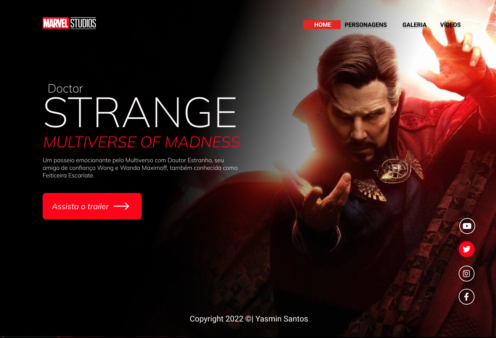
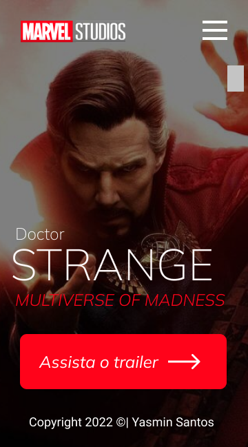

# strange-2022
Projeto construido durante as aulas de LIMA, no curso de desenvolvimento de sistemas do [SENAI Jandira](https://jandira.sp.senai.br/), com orientação do Prof.[Fernando Leonid](href="https://github.com/fernandoleonid")

---

## Qual era o objetivo do projeto?
O objetivo era criar uma landing page com base no design feito no figma, aprendendo a estrutura do HTML, CSS, JS e conceitos de responsividade.

---

## O que é uma Laning Page?
Landing Pages são páginas com foco principal na conversão de visitantes, assim, essas páginas possuem estetica mais minimalista comparada com os sites tradicionais.

---

## Tecnologias usadas

- HTML 5
- CSS 3
- Javascript
- Figma

---
 ## Links
 - [Resultado](https://yasmin-nas.github.io/strange-2022/)
 - [Projeto no Figma](https://www.figma.com/file/EHAEFDMnSzwqrYjzSe4uKB/LIMA-STRANGE2?node-id=15%3A4)
 - [Código](https://github.com/Yasmin-Nas/strange-2022)

 ---

 ## Autor
 [Yasmin Santos](https://github.com/Yasmin-Nas)